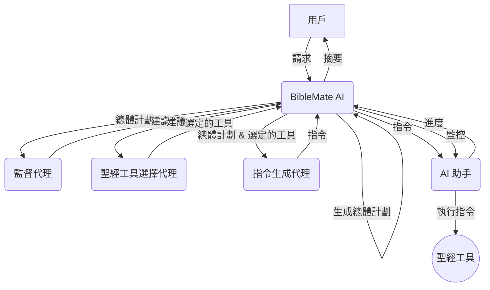

# BibleMate AI

**BibleMate AI** 是一款開創性的自主 AI 代理，旨在徹底改變您的聖經學習方式。它可以創建學習計劃，協調多種聖經工具，並採取多步驟行動來完成複雜的聖經相關任務，例如對特定聖經段落進行深入研究。

開發者：Eliran Wong

https://youtu.be/BxpLmpCm4QU

## 其他語言

英文版：https://github.com/eliranwong/biblemate

簡體中文版：https://github.com/eliranwong/biblematesc

## 👀 總覽

英語：https://youtu.be/L3EY1iDx8lQ

國語：https://youtu.be/BL8HXBFqmvE

粵語：https://youtu.be/MmRR3uMQPd8

## ✨ 核心功能

- **自主 AI 代理：** BibleMate AI 可以獨立工作以滿足您的聖經學習請求。
- **多步驟任務執行：** 它可以將複雜的任務分解為更小、更易於管理的步驟，並按順序執行。
- **豐富的工具集：** 內置超過 40 種聖經工具，由我們全面的聖經套件 [UniqueBible App](https://github.com/eliranwong/UniqueBible) 提供支持。
- **可定制和可擴展：** 高級用戶可以自定義現有工具或添加新工具以滿足其特定需求。
- **靈活的 AI 後端：** 通過 [AgentMake AI](https://github.com/eliranwong/agentmake) 支持多種 AI 後端。

## 🖥️ 支援平台

- Windows
- macOS
- Linux
- ChromeOS
- Android (透過 Piexel Terminal / Termux)

### 支援的 Python 版本

- 3.10
- 3.11
- 3.12

## 🧩 代理工作流程

1.  **BibleMate AI** 接收來自用戶的請求。
2.  **BibleMate AI** 分析請求並確定需要多個步驟才能完成。
3.  **BibleMate AI** 生成一個`總體計劃`，概述完成請求所需的步驟。
4.  **BibleMate AI** 將`總體計劃`發送給監督代理，後者審查提示並提供改進建議。
5.  **BibleMate AI** 將建議發送給聖經工具選擇代理，後者為`總體計劃`的每個步驟選擇最合適的聖經工具。
6.  **BibleMate AI** 將選定的聖經工具和`總體計劃`發送給指令生成代理，後者將建議轉換為清晰簡潔的指令，供 AI 助手遵循。
7.  **BibleMate AI** 將指令發送給 AI 助手，後者使用選定的聖經工具執行指令。
8.  **BibleMate AI** 監控 AI 助手的進度，並根據需要提供額外的建議或指令。
9.  所有步驟完成後，**BibleMate AI** 會向用戶提供結果的簡潔摘要。
10. 用戶收到最終響應，完全解決了他們最初的請求。

### 工作流程圖

## 🚀 快速入門

請在 https://github.com/eliranwong/biblematetc/blob/main/docs/installation/macOS.md 閱讀最新的安裝說明

> pip install --upgrade biblematetc

要運行 BibleMate AI：

> biblematetc

或

> bmtc

在 BibleMate AI 提示符中輸入您的請求。

- 按 `Ctrl+S` 提交您的請求。
- 按 `Ctrl+Y` 顯示幫助信息。
- 按 `Ctrl+Q` 退出 BibleMate AI 提示符。

## 🗣️ AI 模式

您可以根據自己的喜好在三種 AI 模式之間進行選擇：

*   **聊天模式** – 提供直接的文本響應，不使用工具，非常適合簡單的查詢。
*   **代理模式** – 一個完全自主的代理，旨在規劃、協調工具並採取多個行動來處理用戶請求。
*   **夥伴模式** – 一種半自動模式，讓您通過審查和編輯提示參與流程，從而更好地控制 AI 的行為。

`夥伴模式`在新安裝時設置為默認模式。

要切換模式，請在 BibleMate AI 提示符中使用 `.mode` 命令。這將打開一個選擇對話框，您可以在其中選擇您喜歡的模式。

為了幫助用戶了解當前的 AI 模式，輸入邊框的顏色會隨著模式的切換而改變。

## 📖 教學

* 🔌 [可選設置](https://github.com/eliranwong/biblematetc/blob/main/docs/installation/additional_setup.md)
* ⚙️ [配置 AI 後端](https://github.com/eliranwong/biblematetc/blob/main/docs/backends_setup/README.md)
* 🏃 [操作菜單](https://github.com/eliranwong/biblematetc/blob/main/docs/tutorials/Action_Menu.md)
* ⌨️ [鍵盤快捷鍵](https://github.com/eliranwong/biblematetc/blob/main/docs/tutorials/Key_Bindings.md)
* 🏷️ [特殊輸入前綴](https://github.com/eliranwong/biblematetc/blob/main/docs/tutorials/Special_Entry_Prefixes.md)
* 📚 [內置工具和計劃](https://github.com/eliranwong/biblematetc/blob/main/docs/tutorials/Built-in_Tools_Plans.md)
* 📝 [自定義總體計劃](https://github.com/eliranwong/biblematetc/blob/main/docs/tutorials/Custom_Master_Plan.md)
* 🔧 [單一工具選擇](https://github.com/eliranwong/biblematetc/blob/main/docs/tutorials/Single_Tool_Selection.md)
* ✝️ [UniqueBible 資源](https://github.com/eliranwong/biblematetc/blob/main/docs/tutorials/UniqueBible_Resources.md)
* 🔎 [語義搜索](https://github.com/eliranwong/biblematetc/blob/main/docs/tutorials/Semantic_Searches.md)
* ✒️ [文本編輯器](https://github.com/eliranwong/biblematetc/blob/main/docs/tutorials/Text_Editor.md)
* 🛠️ [自定義](https://github.com/eliranwong/biblematetc/blob/main/docs/tutorials/Customization.md)

## 📄 許可證

本項目根據知識共享署名-非商業性 4.0 國際許可證進行許可 - 有關詳細信息，請參閱 [LICENSE](LICENSE) 文件。

## 🙏 致謝

BibleMate AI 建立在我們其他項目的基礎之上：
*   [UniqueBible App](https.github.com/eliranwong/UniqueBible)
*   [ComputeMate AI](https.github.com/eliranwong/computemate)
*   [AgentMake AI](https.github.com/eliranwong/agentmake)
*   [AgentMake AI MCP](https.github.com/eliranwong/agentmakemcp)
