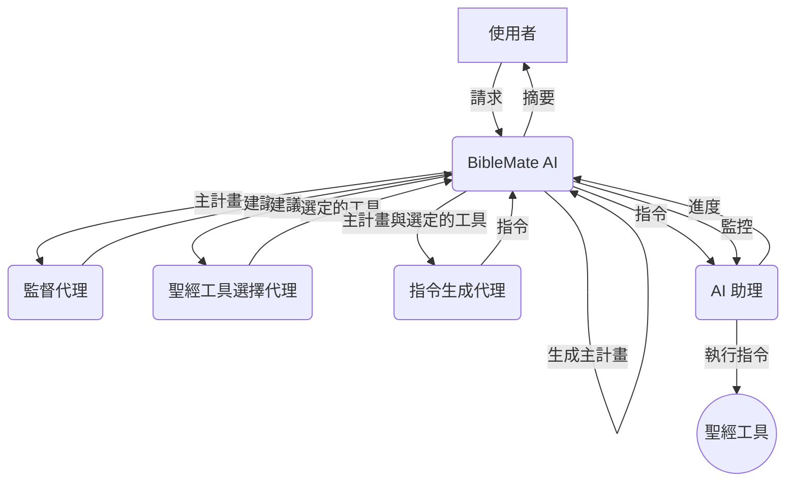

# BibleMate AI (繁體中文)

**BibleMate AI** 是一款突破性的自主 AI 代理，旨在徹底改變您的聖經學習方式。它可以創建學習計劃、協調多種聖經工具，並採取多步驟行動來完成複雜的聖經相關任務，例如對特定聖經段落進行深入研究。

開發者：Eliran Wong


## 其他語言版本

英文版： https://github.com/eliranwong/biblemate

簡體中文版： https://github.com/eliranwong/biblematesc

## 安裝例子

https://github.com/eliranwong/biblematetc/blob/main/docs/installation/macOS.md

## 👀 總覽

英文：

[](https://youtu.be/BxpLmpCm4QU)

普通話：

[](https://youtu.be/BL8HXBFqmvE)

廣東話：

[](https://youtu.be/MmRR3uMQPd8)

## ✨ 核心功能

- **自主 AI 代理：** BibleMate AI 可以獨立工作，以滿足您的聖經學習請求。
- **多步驟任務執行：** 它可以將複雜的任務分解為更小、可管理的步驟，並按順序執行。
- **豐富的工具集：** 內建超過 40 種聖經工具，由我們全面的聖經套件 [UniqueBible App](https://github.com/eliranwong/UniqueBible) 提供支援。
- **可自訂與擴充：** 進階使用者可以自訂現有工具或添加新工具，以滿足其特定需求。
- **靈活的 AI 後端：** 透過 [AgentMake AI](https://github.com/eliranwong/agentmake) 支援多種 AI 後端。

## 🖥️ 支援平台

- Windows
- macOS
- Linux
- ChromeOS
- Android (透過 Piexel Terminal / Termux)

### 支援的 Python 版本

- 3.10
- 3.11
- 3.12

## 🧠 支援的 AI 後端

由 AgentMake AI 驅動，BibleMate AI 為使用者提供了使用各種 AI 後端的靈活性。更多資訊請參閱：https://github.com/eliranwong/agentmake#supported-backends

為了比較，我們在以下測試中使用了相同的提示 `深入研究耶利米哀歌 3:22-24` 來測試一些支援的後端：

BibleMate AI + `Azure + ChatGPT 5` https://youtu.be/QvPIyHOhrP0

BibleMate AI + `Gemini API + Gemini 2.5 Flash` https://youtu.be/AZ-zEl_StC0

BibleMate AI + `Mistral Large` https://youtu.be/7sBfj2TMoOE

BibleMate AI + `DeepSeek 3.1` https://youtu.be/FUr--ULDCZM

BibleMate AI + `Groq + GPT-OSS 120B` https://youtu.be/7sBfj2TMoOE

BibleMate AI + `Groq + Llama 3.3 70B` https://youtu.be/oKQyIEnMM8M

BibleMate AI + `XAI + Grok 4` https://youtu.be/JgcxciOc_Ys

### 後端設定範例

更多詳情請參閱 https://github.com/eliranwong/biblematetc/tree/main/docs/backends_setup。

### 提示

為了快速上手，我們建議從 `googleai` 後端開始，該後端已與 BibleMate AI 進行了廣泛測試。您可以免費獲取 Gemini API 金鑰。更多資訊請訪問：[https://github.com/eliranwong/biblematetc/blob/main/docs/backends_setup/googleai.md](https://github.com/eliranwong/biblematetc/blob/main/docs/backends_setup/googleai.md)。

## 🎬 示範 - 代理模式

[](https://youtu.be/QvPIyHOhrP0)

另一個範例：[深入研究啟示錄第 7 章](https://github.com/eliranwong/biblematetc/blob/main/test/In-depth_study_on_Revelation_7.md)

## 🧩 代理工作流程

1.  **BibleMate AI** 接收使用者的請求。
2.  **BibleMate AI** 分析請求並確定需要多個步驟才能完成。
3.  **BibleMate AI** 生成一個 `主計畫`，概述完成請求所需的步驟。
4.  **BibleMate AI** 將 `主計畫` 發送給監督代理，後者審查提示並提供改進建議。
5.  **BibleMate AI** 將建議發送給聖經工具選擇代理，後者為 `主計畫` 的每個步驟選擇最合適的聖經工具。
6.  **BibleMate AI** 將選定的聖經工具和 `主計畫` 發送給指令生成代理，後者將建議轉換為清晰簡潔的指令，供 AI 助理遵循。
7.  **BibleMate AI** 將指令發送給 AI 助理，後者使用選定的聖經工具執行指令。
8.  **BibleMate AI** 監控 AI 助理的進度，並根據需要提供額外的建議或指令。
9.  所有步驟完成後，**BibleMate AI** 向使用者提供結果的簡潔摘要。
10. 使用者收到最終回應，完全解決其原始請求。

### 工作流程圖



## 🚀 快速入門

> pip install --upgrade biblematetc

> biblematetc

或

> bmtc

在 BibleMate AI 提示中輸入您的請求。

- 按 `Ctrl+S` 提交您的請求。
- 按 `Ctrl+Y` 顯示幫助資訊。

### 設定虛擬環境

例如：

```
cd
python3 -m venv biblematetc
source biblematetc/bin/activate
pip install --upgrade biblematetc
export PATH=$PATH:$HOME/biblematetc/bin
biblematetc
```

### Android 使用者

如果您發現預設的 `stdio` 傳輸在 Pixel Terminal 或 Termux 終端應用程式上無法正常工作，請使用以下解決方法：

解決方法：在兩個不同的標籤頁或會話中運行內建的 MCP 伺服器和 MCP 客戶端。

在一個會話中運行內建的 BibleMate AI MCP 伺服器：

> biblematetcmcp

在另一個會話中運行 BibleMate AI 介面：

> biblematetc -mcp biblematetc

### 支援使用 Vertex AI

執行：

> pip install --upgrade "biblematetc[genai]"

### 升級

再次執行：

> pip install --upgrade biblematetc

### 開發者

> pip install -e .

## ⚙️ 設定 AI 後端

啟動 BibleMate AI 後，輸入：

> .backend

將會開啟一個文字編輯器，供您編輯 AgentMake AI 設定。將 `DEFAULT_AI_BACKEND` 更改為您自己選擇的 AI 後端，並在適當的地方輸入 API 金鑰。

您可以使用 CLI 選項 `-b` 或 `--backend` 暫時覆寫預設的 AI 後端。例如，

> biblematetc -b groq

### 設定 UBA API [可選]

您可以選擇性地透過編輯以下項目來設定 UBA API 後端：

```
# 工具：UBA API
UBA_API_LOCAL_PORT=8080
UBA_API_ENDPOINT="https://bible.gospelchurch.uk/plain"
UBA_API_TIMEOUT=10
UBA_API_PRIVATE_KEY=
```

### 設定遠端 MCP 伺服器驗證 [可選]

您可以選擇性地透過編輯以下項目來設定遠端 MCP 伺服器的驗證資訊：

```
# BibleMate AI
BIBLEMATE_STATIC_TOKEN=
BIBLEMATE_MCP_PUBLIC_KEY=
BIBLEMATE_MCP_PRIVATE_KEY=
BIBLEMATE_MCP_ISSUER=
BIBLEMATE_MCP_AUDIENCE=
```

## 🗣️ AI 模式

您可以在三種 AI 模式之間進行選擇，以適應您的偏好：

*   **聊天模式** – 提供直接的文字回應，不使用工具，非常適合簡單的查詢。
*   **代理模式** – 一個完全自主的代理，旨在規劃、協調工具並採取多個行動來處理使用者請求。
*   **夥伴模式** – 一種半自動模式，讓您參與審查和編輯提示的過程，從而對 AI 的行動有更多的控制。

新安裝時，`夥伴模式` 為預設模式。

要在模式之間切換，請在 BibleMate AI 提示中使用 `.mode` 命令。這將打開一個選擇對話框，您可以在其中選擇您偏好的模式。


為了幫助使用者了解當前的 AI 模式，輸入框的邊框顏色會在切換模式時發生變化。


您可以在 `config.py` 中自訂代理模式和夥伴模式的邊框顏色，方法是更改 `color_agent_mode` 和 `color_partner_mode` 的值。

## 📚 內建工具與計畫

### 內建工具

要查看內建工具及其描述的完整列表，請參閱 [TOOLS.md](TOOLS.md) 文件。

要啟用或停用某些工具，請在 BibleMate AI 提示中輸入 `.tools`。

啟用 `代理模式` 後，所有已啟用的內建工具都會被考慮並自動為完成使用者請求的每個步驟選擇。

### 內建計畫

內建計畫是預定義的、經常使用的「主計畫」，使用者可以快速存取。目前，我們添加了兩個內建計畫作為示範。使用者可以透過[自訂](https://github.com/eliranwong/biblemate#customization)添加自己的計畫。

以正斜線 `/` 開始您的提示以呼叫計畫，例如：

> /simple_bible_study John 3:16

> /bible_devotion Deut 6:4

## 🛠️ 單一工具選擇

在某些情況下，您可能希望為簡單的任務指定一個特定的工具，而不是在完全自動的 `代理模式` 中自動選擇多個工具。

您可以在提示的開頭使用 `@` 前綴一個工具名稱來指定單一工具。例如，

```
@retrieve_bible_cross_references Deut 6:4; John 3:16
```

觀看此影片：https://youtu.be/50m1KRj6uhs

BibleMate AI 也可以自動選擇單一工具來處理您的請求。只需在您的請求開頭輸入 `@` 後跟一個空格，而不是指定工具名稱。例如，

```
@ Read Deut 6:4; John 3:16
```

## 📝 自訂主計畫

在某些情況下，您可能希望為複雜的任務指定一個包含多個工具用於不同步驟的 `自訂計畫`，而不是在完全自動的代理模式下自動生成 `主計畫`。

您可以使用自己的自訂「主計畫」，而不是由 BibleMate AI 生成的計畫。為此，請在您的 BibleMate AI 提示開頭輸入 `@@`，後跟您自己的聖經學習主計畫。

例如，

```
@@ 使用以下步驟分析約翰福音 3:16：
1. 呼叫工具 'retrieve_english_bible_verses' 獲取聖經文本，
2. 呼叫工具 'retrieve_bible_cross_references' 獲取聖經交叉引用，
3. 呼叫工具 'interpret_new_testament_verse' 進行解釋，以及
4. 呼叫工具 'write_bible_theology' 解釋其神學。
```

觀看此影片：https://youtu.be/Lejq0sAx030

另一個範例：

```
@@ 使用以下步驟撰寫關於申命記 6:4 的感人靈修：
1. 使用 @study_old_testament_themes 分析主題
2. 使用 @identify_bible_keywords 識別並解釋經文中的關鍵聖經關鍵詞
3. 使用 @write_bible_insights 為靈修撰寫見解
4. 使用 @write_bible_applications 將經文與日常生活聯繫起來
5. 使用 @write_bible_devotion 撰寫一篇感人的靈修。
確保每個步驟都得到明確處理，並且最終輸出具有凝聚力和啟發性
```

觀看此影片：https://youtu.be/NYPyujFG09E

即使您正在使用「聊天」模式並停用了「代理」模式，「@@」技巧也有效。

## 🏃 操作選單

| 命令                  | 描述                               |
|----------------------|------------------------------------|
| `.new`               | 新對話                              |
| `.exit`              | 退出 BibleMate AI                  |
| `.backend`           | 更改後端                            |
| `.mode`              | 更改 AI 模式                        |
| `.tools`             | 列出可用工具                         |
| `.plans`             | 列出可用計畫                         |
| `.resources`         | 列出可用資源                         |
| `.editprompt`        | 編輯當前提示                         |
| `.backup`            | 備份對話                            |
| `.reload`            | 重新載入當前對話                     |
| `.edit`              | 編輯當前對話                        |
| `.trim`              | 修剪當前對話                        |
| `.import`            | 匯入對話                           |
| `.export`            | 匯出對話                           |
| `.find`              | 搜尋對話                           |
| `.content`           | 顯示當前目錄內容                    |
| `.open`              | 開啟檔案或目錄                      |
| `.ideas`             | 生成想法                           |
| `.autosuggest`       | 切換自動輸入建議                   |
| `.autoprompt`        | 切換自動提示工程                   |
| `.light`             | 切換輕量上下文                     |
| `.steps`             | 設定最大步驟數                     |
| `.matches`           | 設定最大語意匹配數                 |
| `.download`          | 下載資料檔案                       |
| `.help`              | 顯示幫助頁面                       |

一些命令設計用於從 UniqueBible App 檢索內容：

| 命令                 | 描述                               |
|----------------------|------------------------------------|
| `.bible`             | 開啟聖經經文                       |
| `.chapter`           | 開啟聖經章節                       |
| `.compare`           | 比較聖經經文                       |
| `.comparechapter`    | 比較聖經章節                       |
| `.chronology`        | 開啟聖經年代表                     |
| `.commentary`        | 開啟註釋                           |
| `.aicommentary`      | 開啟 AI 註釋                       |
| `.index`             | 開啟經文研究索引                   |
| `.translation`       | 開啟逐字翻譯和譯本                 |
| `.discourse`         | 開啟語篇分析                       |
| `.morphology`        | 開啟形態學資料                     |
| `.xref`              | 開啟交叉引用                       |
| `.treasury`          | 開啟 TSKE                          |
| `.search`            | 搜尋聖經                           |
| `.parallel`          | 搜尋聖經平行經文                   |
| `.promise`           | 搜尋聖經應許                       |
| `.dictionary`        | 搜尋詞典                           |
| `.encyclopedia`      | 搜尋百科全書                       |
| `.lexicon`           | 搜尋詞典                           |
| `.topic`             | 搜尋聖經主題                       |
| `.name`              | 搜尋聖經名稱                       |
| `.character`         | 搜尋聖經人物                       |
| `.locations`         | 搜尋聖經地點                       |

快速鍵 `Ctrl+B`、`Ctrl+C`、`Ctrl+V` 和 `Ctrl+X` 設計用於在 BibleMate AI 中開啟 UBA 內容 [[閱讀](https://github.com/eliranwong/biblemate#%EF%B8%8F-keyboard-shortcuts)]。

### 備註：

*   使用 `.light` 啟用或停用*輕量上下文*。啟用*輕量上下文*（預設）時，BibleMate 運行速度稍快，工具回應品質略有折衷。停用*輕量上下文*時，使用完整上下文，這會消耗更多權杖進行處理，但提供更高的回應品質。
*   要使用 `.import`，您需要指定一個包含已儲存對話的 python 檔案。每次執行備份時，對話都會儲存到一個檔案中。檢查訊息 `Conversation backup saved to ...` 或在 `~/agentmake/computemate` 中找到備份。除了載入單純的對話，您還可以同時載入對話及其主計畫。為此，請指定一個包含 `conversation.py` 和 `master_plan.md` 的備份目錄路徑。
*   要使用 `.open`，您需要指定要開啟的檔案或目錄。
*   `.edit` 命令允許您使用我們的內建文字編輯器編輯當前對話。您可以自訂使用您喜歡的文字編輯器。輸入 `.backend` 並使用呼叫您喜歡的文字編輯器的命令更改 `DEFAULT_TEXT_EDITOR` 的值。
*   使用 `.autosuggest` 切換自動輸入建議。如果停用，您可以使用 `TAB` 鍵開啟輸入建議選單。
*   使用 `.reload` 重新載入上次儲存的對話（如果有的話）。這對於在對話因任何原因中斷後繼續未完成的代理流程很有用。
*   命令 `.matches` 僅適用於本地 MCP 連接。它不適用於遠端 MCP 連接，因為本地設定的更改不會影響遠端伺服器中的設定。
*   當 `.` 後面的內容與上面列出的操作命令不匹配時，以 `.` 開始您的請求以直接檢索聖經經文或章節，或執行聖經搜尋。例如：
    -   輸入 `.John 3:16` 閱讀約翰福音 3:16
    -   輸入 `.John 3` 閱讀約翰福音第 3 章
    -   輸入 `.Jesus love` 執行 `Jesus love` 的聖經搜尋

## ✝️ UniqueBible 資源

我們在 BibleMate AI 中結合了兩全其美的優點，以增強您的聖經學習。除了動態 AI 工具外，我們還整合了透過 BibleMate AI 提示直接存取大多數 [UniqueBible 資源](https://github.com/eliranwong/UniqueBible) 的功能。在與 AI 代理對話的任何時候，您都可以將 UniqueBible App 資料直接納入討論，以豐富學習流程和內容。

在 BibleMate AI 提示中輸入 `.resources` 以查看可用資源。可用 UniqueBible 資源的數量取決於您在後端設定中配置的 [UniqueBible 網頁伺服器](https://github.com/eliranwong/UniqueBible)。預設情況下，BibleMate AI 使用在 https://bible.gospelchurch.uk 運行的 UniqueBible 網頁伺服器。UniqueBible 伺服器是高度可自訂的；您可以設定一個帶有自訂資源的本地伺服器與 BibleMate AI 一起使用。

要將 BibleMate AI 與您的本地伺服器連接，請在 BibleMate AI 提示中輸入 `.backend`，找到下面的會話，並填寫您的本地伺服器詳細資訊：

```
# 工具：UBA API
UBA_API_LOCAL_PORT=8080
UBA_API_ENDPOINT="http://127.0.0.1:8080/plain"
UBA_API_TIMEOUT=10
UBA_API_PRIVATE_KEY=
```

提示：以 `//` 開始您的提示以從輸入建議中查看可用資源。

## 🔎 語意搜尋 [可選]

要啟用語意搜尋，您需要兩件事：

1.  安裝 Ollama - BibleMate AI 使用 `Ollama` 為語意搜尋生成嵌入。您可以在 https://ollama.com/ 找到說明。
2.  下載一些資料檔案。在 BibleMate AI 提示中輸入 `.download` 並按照彈出對話框下載它們。


您也可以手動下載檔案，解壓縮它們，並將它們放在 `~/agentmake/biblemate/data` 目錄中，其中 `~` 代表使用者的主目錄：

[bible.db](https://drive.google.com/file/d/1E6pDKfjUMhmMWjjazrg5ZcpH1RBD8qgW/view?usp=sharing)

範例：

> @search_the_whole_bible God create

> //john/KJV/Jesus love

[collection.db](https://drive.google.com/file/d/1y4txzRzXTBty0aYfFgkWfz5qlHERrA17/view?usp=sharing)

範例：

> //promise/hope

> //parallel/baptism

[dictionary.db](https://drive.google.com/file/d/1UxDKGEQa7UEIJ6Ggknx13Yt8XNvo3Ld3/view?usp=sharing)

範例：

> //dictionary/Israel

[encyclopedia.db](https://drive.google.com/file/d/1NLUBepvFd9UDxoGQyQ-IohmySjjeis2-/view?usp=sharing)

範例：

> //encyclopedia/Jesus

> //encyclopedia/ISB/Jesus

[exlb.db](https://drive.google.com/file/d/1Hpo6iLSh5KzgR6IZ-c7KuML--A3nmP1-/view?usp=sharing)

範例：

> //topic/hope

> //name/Bethleham

> //character/Samuel

> //location/Jerusalem

## ⌨️ 鍵盤快捷鍵

BibleMate AI 提示欄位支援以下快速鍵：

- `Ctrl+Y`：幫助資訊
- `Ctrl+S` 或 `Esc+ENTER` 或 `Alt+ENTER`：提交輸入
- `Ctrl+N`：新對話
- `Esc+I`：匯入對話
- `Esc+O`：編輯對話
- `Ctrl+O`：在文字編輯器中編輯輸入
- `Ctrl+Q`：退出輸入
- `Ctrl+R`：重設輸入
- `Ctrl+Z`：復原輸入變更
- `Ctrl+W`：儲存提示/計畫
- `Esc+W`：刪除提示/計畫
- `Ctrl+L`：開啟提示/計畫
- `Esc+L`：搜尋提示/計畫
- `Ctrl+B`：開啟聖經相關功能
- `Ctrl+C`：開啟聖經註釋
- `Ctrl+V`：開啟聖經經文功能
- `Ctrl+X`：開啟交叉引用功能
- `Ctrl+F`：開啟搜尋功能
- `Ctrl+J`：更改 AI 模式
- `Ctrl+G`：切換自動輸入建議
- `Esc+G`：生成可嘗試的提示想法
- `Ctrl+P`：切換自動提示工程
- `Esc+P`：改進提示內容
- `Ctrl+D`：刪除
- `Ctrl+H`：退格
- `Ctrl+W`：刪除前一個單詞
- `Ctrl+U`：刪除到行首的文字
- `Ctrl+K`：刪除到行尾的文字
- `Ctrl+A`：移至行首
- `Ctrl+E`：移至行尾
- `Ctrl+LEFT`：向左移動一個單詞
- `Ctrl+RIGHT`：向右移動一個單詞
- `Ctrl+UP`：向上捲動
- `Ctrl+DOWN`：向下捲動
- `Shift+TAB`：插入四個空格
- `TAB` 或 `Ctrl+I`：開啟輸入建議選單
- `Esc+Esc`：關閉輸入建議選單

### 取消載入 AI 回應

在等待回應時，按 `Ctrl+C` 一次或兩次，直到載入被取消。

### 終端機應用程式的通用快捷鍵：

- `Ctrl+Shift+C`：複製
- `Ctrl+Shift+V`：貼上

## ✒️ 內建文字編輯器


您可以使用我們的內建文字編輯器編輯當前提示，方法是在 BibleMate AI 提示欄位中輸入 `.editprompt` 或按 `Ctrl+O`。

您也可以透過執行 `etextedit` 單獨啟動內建編輯器。

您可以在我們的內建文字編輯器 `etextedit` 中使用以 BibleMate AI 和 AgentMake AI 建構的外掛程式。

外掛程式 `Extract Bible References` 和 `Insert Bible Text` 已隨 BibleMate AI 一起安裝。

您也可以添加自己的 `etextedit` 外掛程式並將它們放入 `~/etextedit/plugins`。

更多關於 `etextedit` 的資訊請參閱 https://github.com/eliranwong/etextedit

## 匯出為 DOCX 或 PDF [可選]

`etextedit` 提供將內容匯出為 DOCX 和 PDF 檔案的選項。

-   需要 `pandoc` 才能將內容匯出為 DOCX 格式。例如，在 Debian/Ubuntu 上安裝：

> sudo apt install pandoc

-   需要 `pdflatex` 才能將內容匯出為 PDF 格式。例如，在 Debian/Ubuntu 上安裝：

> sudo apt install texlive-full

## 第三方文字編輯器 [可選]

您可以使用您自己選擇的第三方文字編輯器。在 BibleMate AI 提示中輸入 `.backend` 並使用呼叫您喜歡的文字編輯器的命令指定 `DEFAULT_TEXT_EDITOR` 的值，例如 `micro -softwrap true -wordwrap true`。要使用內建文字編輯器 `etextedit` 進行更改，您只需一個步驟，即儲存 `Ctrl+S` 或退出 `Ctrl+Q`，即可返回 BibleMate AI 提示。但是，使用第三方文字編輯器，您需要在退出前先儲存更改。

## 🛠️ 自訂

BibleMate AI 是高度可自訂的。進階使用者可以修改現有工具、創建新工具，甚至可以透過自訂系統提示來更改 AI 代理的行為。

自訂檔案放置在 AgentMake 使用者目錄中的 `biblemate` 子目錄中（在 Linux/macOS 上通常是 `~/.agentmake/biblemate`，在 Windows 上是 `%USERPROFILE%\.agentmake\biblemate`）。

### 常用提示與計畫

您可以儲存、搜尋、開啟或刪除常用的提示和計畫。

例如：

*   輸入提示並使用 `Ctrl+W` 儲存提示。
*   在提示前加上 `@@` 並使用 `Ctrl+W` 儲存提示。
*   使用 `Esc+W` 刪除已儲存的提示/計畫。
*   使用 `Ctrl+L` 開啟提示/計畫。
*   使用 `Esc+L` 搜尋提示/計畫。

### 覆寫系統提示

代理的核心邏輯由系統提示（markdown 檔案）指導。您可以透過將您自己的版本放置在 `~/.agentmake/systems/biblemate/` 中來覆寫它們。

可自訂的系統提示檔案是：`supervisor.md`、`tool_instruction.md` 和 `tool_selection.md`。您可以將它們從套件安裝資料夾中的 `biblemate/systems` 目錄複製到您的使用者目錄並根據需要進行修改。

### 新增或修改工具與計畫

您可以透過創建自訂的 `bible_study_mcp.py` 檔案來添加您自己的工具和內建計畫（提示）。

1.  首先，在 `biblemate` 套件安裝目錄中找到內建的 `bible_study_mcp.py` 檔案。
2.  將此檔案複製到您的使用者自訂目錄 `~/.agentmake/biblemate/bible_study_mcp.py`。
3.  現在您可以編輯此檔案以使用 `fastmcp` 語法添加或修改工具和提示。BibleMate AI 將自動載入您的自訂檔案而不是內建檔案。

### 使用 http 作為傳輸方式而非 stdio

BibleMate 使用 `stdio` 作為與 BibleMate MCP 伺服器互動的預設傳輸方式。您可以使用 `http` 代替。

在一個執行緒中運行：

> biblematemcp

在另一個執行緒中運行：

> biblemate -mcp biblemate

### 使用本地聖經資料

更多詳情請參閱[此處](https://github.com/eliranwong/biblematetc/issues/15#issuecomment-3314130281)。

### 使用自訂 MCP 伺服器

您可以透過 CLI 選項 `mcp` 使用自訂 MCP 伺服器，例如：

> biblemate -mcp http://127.0.0.1:33333/mcp

### 託管或執行 BibleMate MCP 伺服器

使用預設埠 `33333`：

> biblematemcp

可以在設定檔 `config.py` 中編輯預設埠。

要暫時覆寫預設埠，例如：

> biblematemcp -p 33334

## 📖 教學

... （即將推出） ...

## 📄 授權

本專案根據創用 CC 姓名標示-非商業性 4.0 國際授權條款進行授權 - 詳情請參閱 [LICENSE](LICENSE) 檔案。

## 🙏 致謝

BibleMate AI 建立在我們其他專案的基礎之上：
*   [UniqueBible App](https.github.com/eliranwong/UniqueBible)
*   [ComputeMate AI](https.github.com/eliranwong/computemate)
*   [AgentMake AI](https.github.com/eliranwong/agentmake)
*   [AgentMake AI MCP](https.github.com/eliranwong/agentmakemcp)
