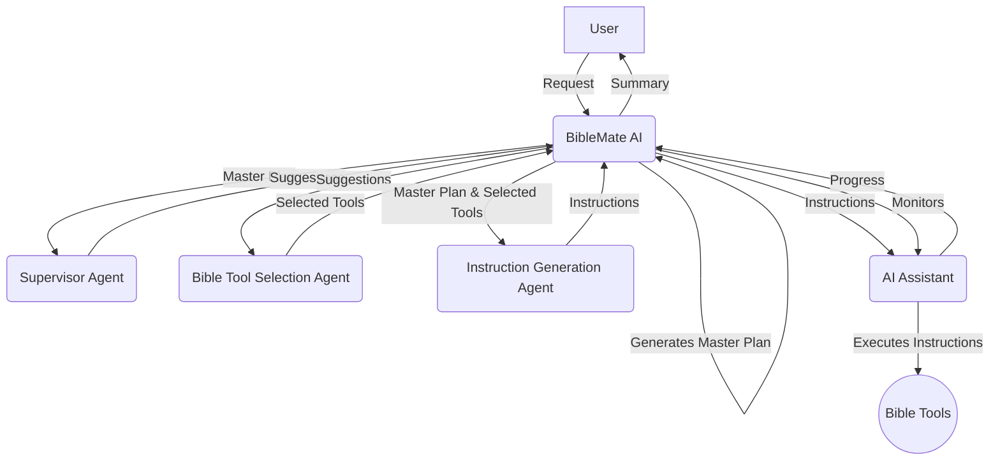

# BibleMate AI

**BibleMate AI** is a groundbreaking, autonomous AI agent designed to revolutionize your Bible study. It can create study plans, coordinate multiple Bible tools, and take multi-step actions to complete complex Bible-related tasks, such as conducting an in-depth study of a particular Bible passage.

Developer: Eliran Wong

https://youtu.be/BxpLmpCm4QU

## Other Languages

Traditional Chinese version: https://github.com/eliranwong/biblematetc

Simplified Chinese version: https://github.com/eliranwong/biblematesc

## 👀 An Overview

English: https://youtu.be/L3EY1iDx8lQ

Mandarin: https://youtu.be/BL8HXBFqmvE

Cantonese: https://youtu.be/MmRR3uMQPd8

## ✨ Core Features

- **Autonomous AI Agent:** BibleMate AI can work independently to fulfill your bible study requests.
- **Multi-step Task Execution:** It can break down complex tasks into smaller, manageable steps and execute them sequentially.
- **Rich Toolset:** Comes with over 40 built-in bible tools, powered by our comprehensive bible suite, the [UniqueBible App](https://github.com/eliranwong/UniqueBible).
- **Customizable and Extensible:** Advanced users can customize existing tools or add new ones to suit their specific needs.
- **Flexible AI Backend:** Supports a variety of AI backends via [AgentMake AI](https://github.com/eliranwong/agentmake).

## 🖥️ Supported Platforms

- Windows
- macOS
- Linux
- ChromeOS
- Android (via Piexel Terminal / Termux)

### Supported Python versions

- 3.10
- 3.11
- 3.12

## 🧩 Agentic Workflow

1.  **BibleMate AI** receives a request from a user.
2.  **BibleMate AI** analyzes the request and determines that it requires multiple steps to complete.
3.  **BibleMate AI** generates a `Master Plan` that outlines the steps needed to complete the request.
4.  **BibleMate AI** sends the `Master Plan` to a supervisor agent, who reviews the prompt and provides suggestions for improvement.
5.  **BibleMate AI** sends the suggestions to a bible tool selection agent, who selects the most appropriate bible tools for each step of the `Master Plan`.
6.  **BibleMate AI** sends the selected bible tools and the `Master Plan` to an instruction generation agent, who converts the suggestions into clear and concise instructions for an AI assistant to follow.
7.  **BibleMate AI** sends the instructions to an AI assistant, who executes the instructions using the selected bible tools.
8.  **BibleMate AI** monitors the progress of the AI assistant and provides additional suggestions or instructions as needed.
9.  Once all steps are completed, **BibleMate AI** provides a concise summary of the results to the user.
10. The user receives the final response, which fully resolves their original request.

### Workflow Diagram

## 🚀 Quick Start

Read fresh installation instructions at https://github.com/eliranwong/biblemate/blob/main/docs/installation/macOS.md

> pip install --upgrade biblemate

To run BibleMate AI:

> biblemate

or

> bm

Enter your request in the BibleMate AI prompt.

- Press `Ctrl+S` to submit your request.
- Press `Ctrl+Y` to display help information.
- Press `Ctrl+Q` to exit the BibleMate AI prompt.

## 🗣️ AI Modes

You can select between three AI modes to suit your preferences:

*   **Chat mode** – Provides direct text responses without using tools, ideal for simple queries.
*   **Agent mode** – A fully autonomous agent designed to plan, orchestrate tools, and take multiple actions to address user requests.
*   **Partner mode** – A semi-automated mode that involves you in the process with review and edit prompts, giving you more control over the AI's actions.

`Partner mode` is set as the default on fresh installation.

To switch between modes, use the `.mode` command in the BibleMate AI prompt. This will open a selection dialog where you can choose your preferred mode.

To help users stay aware of the current AI mode, the input border color changes when switching between modes.

## 📖 Tutorials

* 🔌 [Optional Setup](https://github.com/eliranwong/biblemate/blob/main/docs/installation/additional_setup.md)
* ⚙️ [Configure AI Backend](https://github.com/eliranwong/biblemate/blob/main/docs/backends_setup/README.md)
* 🏃 [Action Menu](https://github.com/eliranwong/biblemate/blob/main/docs/tutorials/Action_Menu.md)
* ⌨️ [Keyboard Shortcuts](https://github.com/eliranwong/biblemate/blob/main/docs/tutorials/Key_Bindings.md)
* ✨ [Special Entry Prefixes](https://github.com/eliranwong/biblemate/blob/main/docs/tutorials/Special_Entry_Prefixes.md)
* 📚 [Built-in Tools & Plans](https://github.com/eliranwong/biblemate/blob/main/docs/tutorials/Built-in_Tools_Plans.md)
* 📝 [Custom Master Plan](https://github.com/eliranwong/biblemate/blob/main/docs/tutorials/Custom_Master_Plan.md)
* 🔧 [Single Tool Selection](https://github.com/eliranwong/biblemate/blob/main/docs/tutorials/Single_Tool_Selection.md)
* ✝️ [UniqueBible Resources](https://github.com/eliranwong/biblemate/blob/main/docs/tutorials/UniqueBible_Resources.md)
* 🔎 [Semantic Searches](https://github.com/eliranwong/biblemate/blob/main/docs/tutorials/Semantic_Searches.md)
* ✒️ [Text Editor](https://github.com/eliranwong/biblemate/blob/main/docs/tutorials/Text_Editor.md)
* 🛠️ [Customization](https://github.com/eliranwong/biblemate/blob/main/docs/tutorials/Customization.md)

## 📄 License

This project is licensed under the Creative Commons Attribution-NonCommercial 4.0 International License - see the [LICENSE](LICENSE) file for details.

## 🙏 Acknowledgments

BibleMate AI is built upon the foundations of our other projects:
*   [UniqueBible App](https.github.com/eliranwong/UniqueBible)
*   [ComputeMate AI](https.github.com/eliranwong/computemate)
*   [AgentMake AI](https.github.com/eliranwong/agentmake)
*   [AgentMake AI MCP](https.github.com/eliranwong/agentmakemcp)
